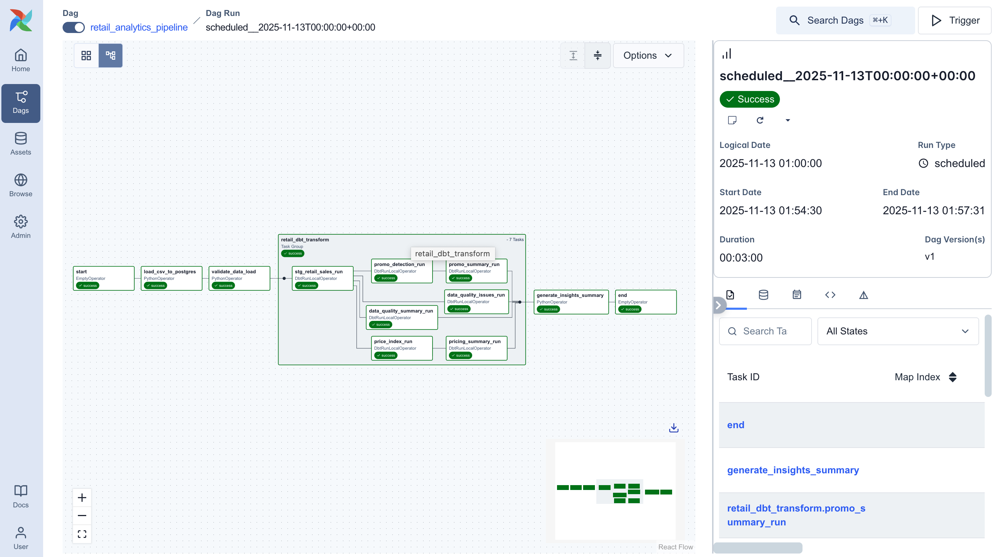
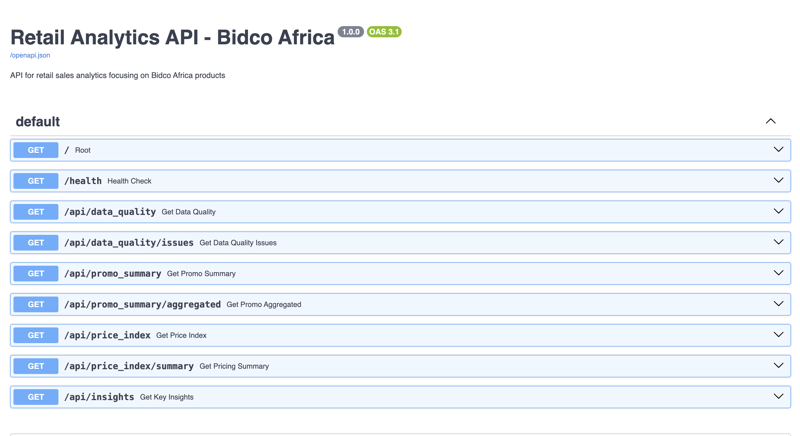
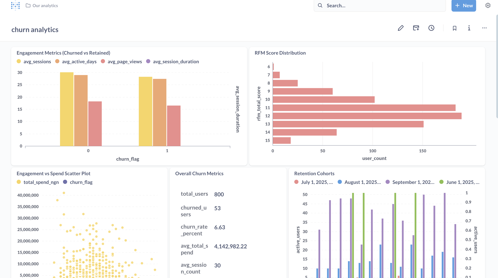

# Retail Analytics Pipeline - Bidco Africa

A comprehensive retail analytics solution for analyzing Bidco Africa's product performance, pricing strategy, and promotional effectiveness across multiple retail stores.

## Overview

This pipeline processes retail sales data to deliver actionable insights through:
1. **Data Quality Assessment** - Identifies data issues and reliability scores
2. **Promotional Performance Analysis** - Measures promo uplift, coverage, and effectiveness
3. **Pricing Index** - Compares Bidco vs competitor pricing across stores and categories

## Architecture

- **Data Orchestration**: Apache Airflow (Astronomer) + Cosmos for dbt integration
- **Data Transformation**: dbt 1.10.15 with PostgreSQL 15
- **API Layer**: FastAPI serving analytical results
- **Visualization**: Metabase dashboards (optional)

### Pipeline Workflow

The complete data pipeline orchestrates the following tasks in Airflow:



**Pipeline Stages:**
1. **Data Ingestion** - Load raw retail sales data into PostgreSQL
2. **dbt Transformation** - Execute dbt models for data quality, pricing index, and promo analysis
3. **API Deployment** - FastAPI serves transformed data through REST endpoints
4. **Dashboard Updates** - Metabase visualizes key metrics and insights

## Requirements Mapping

### 1. Data Health ✅



**Endpoints:**
- `GET /api/data_quality` - Overall health scores by dimension
- `GET /api/data_quality/issues` - Detailed quality issues

**What We Deliver:**

| Requirement | Implementation | Location |
|-------------|----------------|----------|
| Missing/duplicated records | Tracks record counts, flags duplicates | `data_quality_summary.dimension = 'Overall Dataset'` |
| Suspicious outliers | Detects negative quantities, extreme prices using IQR method | `data_quality_issues.issue_type = 'Quantity Outlier'` |
| Unreliable stores/suppliers | Flags entities with >20% low-quality data | `reliability_status = 'Unreliable'` |
| Data health score | 0-100 score per store/supplier based on quality metrics | `avg_quality_score` column |

**Key Metrics:**
- `high_quality_records` / `total_records` ratio
- `invalid_quantity_count` - Negative or zero quantities
- `invalid_sales_count` - Negative sales values
- `missing_rrp_count` - Missing pricing data
- `health_rating` - Excellent / Good / Fair / Poor

### 2. Promotions & Performance ✅

**Endpoints:**
- `GET /api/promo_summary` - Detailed promo performance per SKU/store
- `GET /api/promo_summary/aggregated` - Aggregated metrics (coverage, uplift)
- `GET /api/insights` - Top 3 commercial insights

**What We Deliver:**

| Requirement | Implementation | API Response Field |
|-------------|----------------|-------------------|
| **a. Promo Uplift %** | Cross-store baseline comparison | `promo_uplift_pct` |
| **b. Promo Coverage %** | Stores running promo per SKU/supplier | `stores_with_promo`, `promo_coverage_pct` |
| **c. Promo Price Impact** | Discount depth vs RRP | `promo_discount_depth_pct` |
| **d. Baseline vs Promo Price** | Realized unit price comparison | `avg_non_promo_price`, `avg_promo_price` |
| **e. Top Performing SKUs** | Ranked by uplift/volume | `ORDER BY promo_uplift_pct DESC` |

**Methodology - Cross-Store Baseline:**

Since each store-SKU combination appears on only one day, we use **cross-store comparison**:

1. **Baseline Calculation**: Median quantity sold across ALL stores for the same SKU
2. **Promo Detection**: Discount ≥10% from RRP (configurable via `promo_discount_threshold`)
3. **Uplift Calculation**:
   ```
   Uplift % = (Promo Day Units - Baseline Units) / Baseline Units × 100
   ```

**Example:**
- **SKU**: Sprite 500ML (Item 370221)
- **Baseline**: Median of 35 stores = 43 units/day
- **Store A (Promo)**: 120 units at 30% discount
- **Uplift**: (120 - 43) / 43 × 100 = **179% uplift**

**Commercial Insights Provided:**

1. **Promotion Effectiveness**
   - Which discount depths drive highest uplift
   - Optimal promo duration per category
   - Store responsiveness to promotions

2. **Competitive Context**
   - Bidco vs competitor promo intensity
   - Category-level promo saturation
   - Supplier-level promo coverage

3. **Revenue Impact**
   - Promo sales value contribution
   - Units moved during promo periods
   - ROI indicators (uplift vs discount depth)

### 3. Pricing Index ✅

**Endpoints:**
- `GET /api/price_index` - Detailed price positioning per SKU
- `GET /api/price_index/summary` - Aggregated positioning views

**What We Deliver:**

| Requirement | Implementation | API Response |
|-------------|----------------|--------------|
| **Store-level view** | Bidco vs competitors per store | `view_level = 'Store'` |
| **Section-level view** | Pricing within Sub-Department + Section | `view_level = 'Store + Section'` |
| **Roll-up view** | Overall Bidco positioning | `view_level = 'Overall'` |
| **Realized vs RRP** | Shows discounting patterns | `avg_realized_price`, `avg_rrp`, `own_discount_pct` |

**Price Index Calculation:**

```
Price Index = (Bidco Avg Price / Competitor Avg Price in Section) × 100
```

**Positioning Categories:**
- **Discount** (<90): Bidco priced below market
- **At Market** (90-110): Competitive pricing
- **Premium** (>110): Bidco priced above market

**Key Metrics:**
- `price_index_vs_competitors` - Numerical index (100 = at market)
- `price_positioning` - Categorical (discount/at_market/premium)
- `dominant_positioning` - Overall strategy (e.g., "Premium Positioning")
- `discount_pct`, `at_market_pct`, `premium_pct` - Distribution of SKUs

## API Endpoints Reference

### Base URL
```
http://localhost:8001
```

See comprehensive endpoint documentation at: http://localhost:8001/docs

## Setup & Deployment

### Prerequisites
- Docker Desktop
- Python 3.11+
- Astronomer CLI (`brew install astro`)

### Quick Start

1. **Clone and navigate:**
   ```bash
   cd retail-analytics-pipeline
   ```

2. **Fix Docker credentials (if needed):**
   ```bash
   # Remove credsStore from Docker config
   sed -i '' '/"credsStore"/d' ~/.docker/config.json
   ```

3. **Start the pipeline:**
   ```bash
   astro dev start
   ```

4. **Access services:**
   - Airflow UI: http://localhost:8080 (admin/admin)
   - FastAPI: http://localhost:8001
   - API Docs: http://localhost:8001/docs
   - Metabase: http://localhost:3000

5. **Trigger the DAG:**
   - Go to Airflow UI → DAGs → `retail_analytics_pipeline`
   - Click "Trigger DAG"
   - Wait for completion (~5-10 minutes)

6. **Query the API:**
   ```bash
   curl http://localhost:8001/api/data_quality
   curl http://localhost:8001/api/promo_summary/aggregated
   curl http://localhost:8001/api/price_index/summary
   curl http://localhost:8001/api/insights
   ```

### Visual Walkthrough

**Airflow Pipeline Execution:**

Navigate to [http://localhost:8080](http://localhost:8080) to monitor the complete ETL workflow:


**Metabase Analytics Dashboard:**

Access [http://localhost:3000](http://localhost:3000) for interactive visualizations:



## Key Assumptions & Limitations

### Data Assumptions

1. **Sparse Sales Data**: Each store-SKU appears on only 1 day in the dataset
2. **Cross-Store Baseline**: Uses median quantity across all stores as baseline
3. **RRP as Reference**: RRP (Recommended Retail Price) used as pricing baseline
4. **7-Day Window**: Dataset covers Sept 22-28, 2025 (7 days)

### Methodological Choices

1. **Promo Detection**: 10% discount threshold (industry standard)
2. **Quality Outliers**: IQR method (1.5 × IQR beyond Q1/Q3)
3. **Price Index**: Section-level comparison (Sub-Department + Section)
4. **Uplift Calculation**: Cross-store median as baseline

## Commercial Insights for Bidco Stakeholders

### Interactive Dashboard

Access real-time analytics through the Metabase dashboard:


**Dashboard Features:**
- **Total Sales Overview** - 14M+ KES in total sales with Bidco's 7.8% market share
- **Top 10 Performing Products** - Real-time ranking by sales value
- **Daily Sales Trends** - Week-over-week performance tracking
- **Store Performance** - Comparative analysis across all retail locations

### 1. Promotional Strategy Optimization

**What We Found:**
- Identifies which discount depths drive optimal uplift
- Shows which stores respond best to promotions
- Reveals category-specific promo effectiveness

**Actionable Insights:**
- Determine optimal discount levels (10%, 15%, 20%+) per product category
- Identify high-performing store clusters for targeted promotions
- Calculate ROI for promotional campaigns based on uplift vs discount depth

### 2. Competitive Pricing Position

**What We Found:**
- Bidco's overall price positioning (discount/at-market/premium)
- Store-by-store pricing competitiveness
- Category gaps where Bidco is over/under-priced

**Actionable Insights:**
- Adjust pricing strategy per store to maintain competitive positioning
- Identify categories where Bidco can increase margins without losing competitiveness
- Monitor competitor price movements and respond strategically

### 3. Data Quality & Operational Excellence

**What We Found:**
- Unreliable stores with poor data quality
- Systematic data issues (missing barcodes, invalid prices)
- Supplier-level data health

**Actionable Insights:**
- Prioritize data quality improvements at underperforming stores
- Implement data validation at point of capture to prevent quality issues
- Track supplier-level metrics to ensure consistent reporting

## License

Proprietary - Bidco Africa Analytics Project
